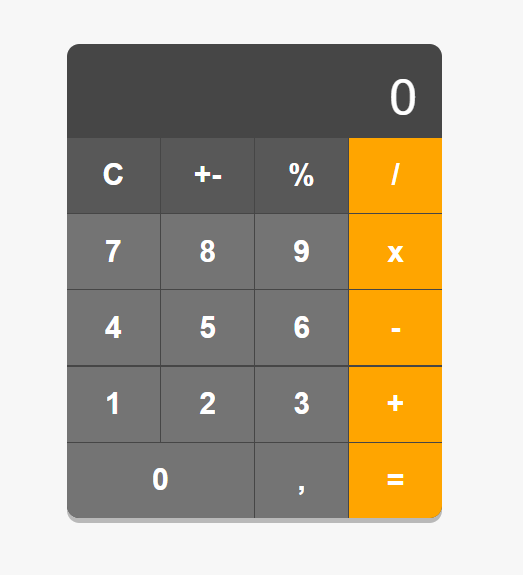

# JavaScript Calculator

This is a simple **JavaScript calculator** project that allows performing basic mathematical operations such as addition, subtraction, multiplication, and division. The interface is built with HTML, styled with CSS, and all calculation logic is managed with JavaScript.

<p align="center">
  
</p>

## Features
- **Basic Operations**: Supports addition, subtraction, multiplication, and division.
- **Number and Decimal Input**: Allows input of integers and decimal numbers.
- **Clear Screen**: Provides a function to reset the calculator display.

## Technologies Used
-   **HTML**: For the interface structure.
-   **CSS**: For the design and styling of the calculator.
-   **JavaScript**: For the calculator logic and user interaction.

## How to Run the Project
1. Clone this repository to your local machine.
    ```bash
    git clone https://github.com/rian-junior/calculadora.git
    ```
2. Open the `index.html` file in your preferred browser to test the calculator.

## Contribution
Feel free to contribute with improvements to this project. Open an issue or submit a pull request.

## License
This project is licensed under the **GNU General Public License v3.0**. See the [LICENSE](LICENSE) file for details.

For more information about this license, visit [https://www.gnu.org/licenses/gpl-3.0.html](https://www.gnu.org/licenses/gpl-3.0.html).
